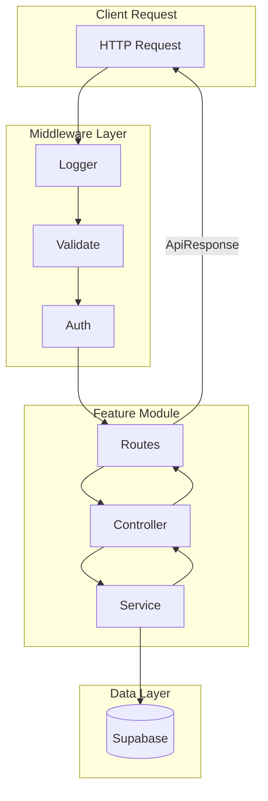

# Backend Architecture

Quick reference for building new API routes.

## Request Flow



## Module Structure

Each feature lives in `src/modules/{module}/` with these files:

```
src/modules/{module}/
├── {module}.routes.ts      # Route definitions + Swagger docs
├── {module}.controller.ts  # Request handlers
├── {module}.service.ts     # Business logic
├── {module}.schema.ts      # Zod validation schemas
├── {module}.constants.ts   # Module-specific constants
└── index.ts                # Public exports
```

---

## Layer Patterns

### 1. Routes (`{module}.routes.ts`)

- Define routes with Swagger JSDoc annotations
- Chain middleware: `validate()` → `authMiddleware` → `controller`
- Use route constants from `constants/api.ts`

```typescript
import { Router } from "express";
import { myController } from "./my.controller.js";
import { validate } from "../../middleware/validate.middleware.js";
import { authMiddleware } from "../../middleware/auth.middleware.js";
import { createSchema } from "./my.schema.js";

const router = Router();

/**
 * @swagger
 * /v1/my-resource:
 *   post:
 *     summary: Create resource
 *     tags: [MyResource]
 *     security:
 *       - BearerAuth: []
 *     requestBody:
 *       required: true
 *       content:
 *         application/json:
 *           schema:
 *             $ref: '#/components/schemas/CreateRequest'
 *     responses:
 *       201:
 *         description: Created successfully
 */
router.post(
  "/create",
  authMiddleware,
  validate({ body: createSchema }),
  myController.create
);

export const myRouter = router;
```

### 2. Controller (`{module}.controller.ts`)

- Handle HTTP concerns (request parsing, response formatting)
- Delegate business logic to service
- Always wrap in try/catch and call `next(error)`

```typescript
import type { Request, Response, NextFunction } from "express";
import { myService } from "./my.service.js";
import { HTTP_STATUS } from "../../constants/api.js";
import { STRINGS } from "../../constants/strings.js";
import type { CreateInput } from "./my.schema.js";
import type { ApiResponse } from "../../types/common.types.js";

export const create = async (
  req: Request<unknown, unknown, CreateInput>,
  res: Response<ApiResponse<MyResponse>>,
  next: NextFunction
): Promise<void> => {
  try {
    const result = await myService.create(req.body, req.user);

    res.status(HTTP_STATUS.CREATED).json({
      success: true,
      message: STRINGS.MY_MODULE.CREATE_SUCCESS,
      data: result,
    });
  } catch (error) {
    next(error);
  }
};

export const myController = { create };
```

### 3. Service (`{module}.service.ts`)

- Contains all business logic
- Interacts with Supabase via `getSupabaseClient()` / `getSupabaseAdminClient()`
- Throws custom errors (don't return error objects)

```typescript
import { getSupabaseAdminClient } from "../../db/client.js";
import { NotFoundError, ConflictError } from "../../utils/errors.js";
import { ERROR_MESSAGES } from "../../constants/errors.js";
import type { CreateInput, MyResponse } from "./my.schema.js";

export const create = async (
  input: CreateInput,
  userId: string
): Promise<MyResponse> => {
  const client = getSupabaseAdminClient();

  const { data, error } = await client
    .from("my_table")
    .insert({ ...input, user_id: userId })
    .select()
    .single();

  if (error) {
    throw new ConflictError(ERROR_MESSAGES.MY_MODULE.CREATE_FAILED);
  }

  return data;
};

export const myService = { create };
```

### 4. Schema (`{module}.schema.ts`)

- Define Zod schemas for validation
- Export inferred TypeScript types

```typescript
import { z } from "zod";
import { ERROR_MESSAGES } from "../../constants/errors.js";

export const createSchema = z.object({
  title: z.string().min(1, ERROR_MESSAGES.VALIDATION.TITLE_REQUIRED).max(255),
  description: z.string().optional(),
});

export type CreateInput = z.infer<typeof createSchema>;

// Response types
export const myResponseSchema = z.object({
  id: z.string().uuid(),
  title: z.string(),
  created_at: z.string(),
});

export type MyResponse = z.infer<typeof myResponseSchema>;
```

### 5. Index (`index.ts`)

- Re-export public API of the module

```typescript
export { myRouter } from "./my.routes.js";
export { myService } from "./my.service.js";
export { myController } from "./my.controller.js";
export * from "./my.schema.js";
export * from "./my.constants.js";
```

---

## Error Handling

Use custom error classes from `utils/errors.ts`:

| Error Class           | HTTP Status | When to Use            |
| --------------------- | ----------- | ---------------------- |
| `BadRequestError`     | 400         | Invalid request format |
| `UnauthorizedError`   | 401         | Missing/invalid auth   |
| `ForbiddenError`      | 403         | No permission          |
| `NotFoundError`       | 404         | Resource not found     |
| `ConflictError`       | 409         | Duplicate resource     |
| `ValidationError`     | 422         | Validation failure     |
| `InternalServerError` | 500         | Unexpected errors      |

```typescript
import { NotFoundError, UnauthorizedError } from "../../utils/errors.js";
import { ERROR_MESSAGES, ERROR_CODES } from "../../constants/errors.js";

// In service:
if (!resource) {
  throw new NotFoundError(ERROR_MESSAGES.RESOURCE.NOT_FOUND);
}

// With custom error code:
throw new UnauthorizedError(
  ERROR_MESSAGES.AUTH.TOKEN_INVALID,
  ERROR_CODES.TOKEN_INVALID
);
```

---

## Response Format

All responses use `ApiResponse<T>`:

```typescript
// Success
{
  success: true,
  message: "Operation successful",
  data: { ... }
}

// Error (handled by error.middleware.ts)
{
  success: false,
  error: {
    message: "Error description",
    code: "ERR_CODE",
    statusCode: 400,
    timestamp: "2024-01-01T00:00:00.000Z"
  }
}
```

---

## Middleware

| Middleware                          | Purpose                              | Usage             |
| ----------------------------------- | ------------------------------------ | ----------------- |
| `authMiddleware`                    | Require valid JWT, attach `req.user` | Protected routes  |
| `optionalAuthMiddleware`            | Attach `req.user` if token valid     | Optional auth     |
| `validate({ body, query, params })` | Zod validation                       | Before controller |

---

## Registering Routes

In `app.ts`, register your module router:

```typescript
import { myRouter } from "./modules/my/index.js";

// Add after other routes
app.use(`${API_CONFIG.FULL_PREFIX}/my-resource`, myRouter);
```

---

## Checklist: Adding a New Route

1. [ ] Create module folder: `src/modules/{module}/`
2. [ ] Define schemas in `{module}.schema.ts`
3. [ ] Implement business logic in `{module}.service.ts`
4. [ ] Create controller handlers in `{module}.controller.ts`
5. [ ] Define routes with Swagger docs in `{module}.routes.ts`
6. [ ] Create `index.ts` with exports
7. [ ] Add constants to `constants/api.ts`, `constants/errors.ts`, `constants/strings.ts`
8. [ ] Register router in `app.ts`
9. [ ] Add Swagger schema definitions if needed in `config/swagger.ts`
10. [ ] Write tests in `tests/`
